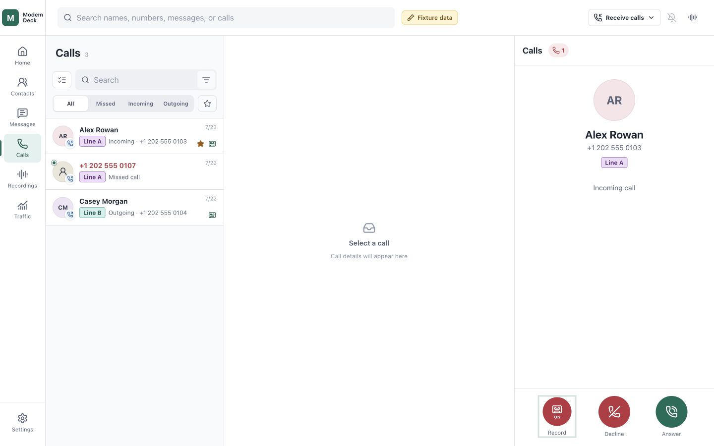
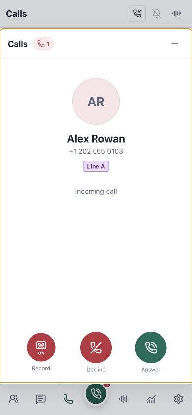
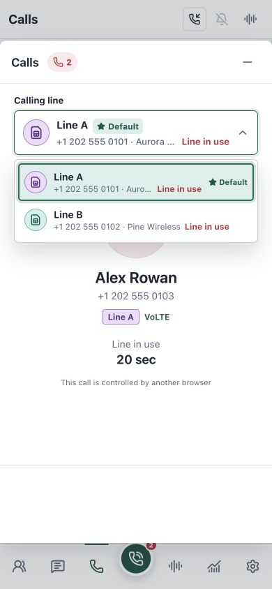

# ModemDeck（中文）

[](LICENSE)

ModemDeck 是一个管理蜂窝通话、短信、联系人、流量和多条线路的自托管控制台。
项目受到 [VoHive](https://github.com/iniwex5/vohive) 启发，但与其没有官方关系。

## 功能

- 多线路仪表盘、可自定义线路标签、默认线路和联系人首选线路。
- 联系人头像、收藏和批量操作；只读 Google Contacts 导入及 vCard
  导入/导出。
- 按线路收发短信、已读与收藏状态、批量处理、断线重连和实时更新。
- 通话记录、拨号、DTMF、全局或单线路来电策略，以及可逐通话开启的录音和
  实时录音片段。
- 独立 Modem 的活动通话会话、线路预占、占线状态和浏览器控制权；多路通话
  尚待多模组实机验证。
- 分线路流量统计、连接状态和 HTTP/SOCKS5 代理。
- SIM/eSIM、卡槽、归属与当前运营商及漫游状态。
- 自动匹配浏览器语言，也可在九种界面语言之间手动切换。
- 设备、联系人和代理操作的应用内确认。
- 初始管理员与普通成员、线路分配、用户通讯录和个人偏好。
- 加密凭据、可绑定用户或手动限定线路范围的 Telegram 机器人。

## 界面

| 场景 | 桌面端 | 手机端 |
| --- | --- | --- |
| 多线路总览：在线状态、默认线路与流量 |  |  |
| 按线路消息：未读、收藏与联系人动作 |  |  |
| 通话记录：详情与录音片段 |  |  |
| 模拟来电：录音开关已开启 |  |  |
| 多路通话：两条线路同时占用与切换 |  |  |

## 路线图

| 里程碑 | 状态 | 范围 |
| --- | --- | --- |
| M1 自托管多线路控制台 | ✅ 已实现 | 设备、线路、短信、联系人、流量、代理、设置和部署流程。 |
| M2 单路通话 | ✅ 已实现 | 拨号、接听、拒接、挂断、DTMF、浏览器音频和通话录音。 |
| M3 多路通话 | 🧪 已实现，未测试 | 每个 Modem 的独立通话会话、线路预占、占线显示和线路切换；待多模组实机验证。 |
| M4 多用户 | ✅ 已实现 | 初始管理员、普通成员、线路分配、用户通讯录、个人偏好和 Telegram 绑定。 |
| M5 iOS App + CallKit | 🧱 iOS 消费 API groundwork | 已实现按用户配对、受限 Mobile Bearer API、通话会话复用与 Cloudflare TURN 中继配置。iOS 固定使用 Cloudflare HTTPS，不实现 LAN 探测或线路切换；原生客户端、CallKit 和后台通知仍待实现。 |

只有安装并连接 Cloudflare Tunnel 后才能创建 iOS 配对。二维码包含自动发现的
Cloudflare API HTTPS 地址和每用户凭据，不包含 LAN 地址，也没有过期时间；
首次通过该凭据认证的 iOS API 请求会确认配对，关闭二维码不影响等待确认。
凭据由用户或管理员撤销后才失效。iOS 通话复用现有 Call API 和 WebRTC
媒体边界，并通过 Cloudflare TURN 强制中继；原生客户端和后台生命周期将在
M5 后续阶段实现。

## 架构

ModemDeck 默认由三个职责隔离的容器组成，并可选启用第四个 Tunnel 容器：

- `modemdeck` 是非特权 Nginx 网关，使用三个职责分离的 listener：Compose
  内网的 HTTP `7575` 只转发 `/api/*`，其他路径一律返回 404；Compose 内网
  的 HTTP `7576` 为 Cloudflare Tunnel 提供 Web 与同源 API；HTTPS `7577`
  提供本地 Web 管理页，并且只有这个端口会映射到宿主机。误用 HTTP 访问
  `7577` 时会自动升级到同地址的 HTTPS。
- `api` 是非特权 Go HTTP 服务，在 Compose 内网的 `8080` 负责身份验证、
  通信流程和 SQLite 数据。它没有宿主机端口，也不接触
  `/dev`、D-Bus、硬件状态或主机网络，只通过只读挂载的 Unix 套接字调用
  Agent。
- `hardware` 运行私有 D-Bus、定制生产版 ModemManager 1.24.0 和 Agent，
  独占 ModemDeck 的设备控制、蜂窝数据面和网络配置。ModemManager 的生产版
  AT 接口已在构建时启用，不依赖调试模式。
- 可选的 `cloudflared` 与 Nginx 位于同一 Compose 网络。用户可在 Cloudflare
  中自行把公网主机名指向 API-only origin `http://modemdeck:7575`、Web
  origin `http://modemdeck:7576`，或同时配置两者；ModemDeck 不管理这些
  ingress 规则，也不提供额外的暴露开关。

管理员可在“设置 → Web 证书”查看本地 `7577` 证书、下载自动签发 CA、上传
PEM 证书链与匹配私钥，或切回自动证书。API 会原子更新持久化证书，Nginx
通过只读挂载检测变更并热加载。这里不会修改 Cloudflare 边缘证书或 iOS
连接地址。

默认的 **simple** 模式会停用宿主 ModemManager 和旧 `modemdeck-agent`，
阻止宿主 ModemManager 自动启动，再由容器自动发现模组。**advanced** 模式只
管理 assignment 文件中明确分配的设备；它绝不修改宿主 ModemManager、udev、
Polkit、防火墙或其他服务。宿主系统和设备分配由用户负责，发现设备缺失、歧义
或所有权冲突时 ModemDeck 会拒绝启动，而不是抢占设备。

更多边界和 assignment 格式见[部署说明](deploy/README.md)与
[硬件运行时说明](hardware/README.md)。不支持的硬件操作会明确失败，不猜测
设备路径或切换控制后端。

## 硬件兼容性

### Quectel QCFG USB

Linux 基线使用 Quectel USB、`qmi_wwan`、ModemManager 和 `usbnet=0`。
命令定义见 Quectel
[EC2x/EG2x/EG9x/EM05 QCFG AT 命令手册 V1.0](https://www.quectel.com/content/uploads/2024/02/Quectel_EC2xEG2xEG9xEM05_Series_QCFG_AT_Commands_Manual_V1.0.pdf)。

已验证的 USB 身份和接口配置为：

```text
AT+QCFG="usbcfg",0x2C7C,0x0125,1,1,1,1,1,0,0
                         |      | | | | | | |
                         |      | | | | | | +-- USB 语音接口：禁用
                         |      | | | | | +---- ADB：禁用
                         |      | | | | +------ USB 网络接口：启用
                         |      | | | +-------- Modem 端口：启用
                         |      | | +---------- AT 端口：启用
                         |      | +------------ NMEA 端口：启用
                         |      +-------------- 诊断端口：启用
                         +--------------------- VID:PID 2c7c:0125
```

该配置自动保存，重启模组后生效。换到另一台主机时配置仍然保留。它只改变 USB
描述符和接口，不会安装驱动或改变硬件型号。

`usbcfg` 倒数第二位控制 ADB；网络协议由 `usbnet` 单独选择：

```text
AT+QCFG="usbnet",0   # RmNet/QMI
AT+QCFG="usbnet",1   # ECM / USB 以太网
AT+QCFG="usbnet",2   # MBIM
AT+QCFG="usbnet",3   # RNDIS
```

Linux 已验证 `usbnet=0`。macOS 没有 Quectel QMI 驱动。要使用直连 USB
以太网，先在支持 AT 命令的主机上改为 `usbnet=1`，再重启模组。第三方已验证
QDC507 的 ECM 模式可用于 macOS 和 iPadOS。这只证明网络接口可用，不代表 AT、
短信或语音功能。[Apple 文档](https://support.apple.com/zh-cn/108894)列出了
iPadOS 的 USB 转以太网支持。Windows 是否可用取决于 QMI、ECM 或 MBIM 驱动。

实测固件需要将 USB 语音接口设为 `1`，ModemManager 才能可靠拨号、接听和挂断：

```text
AT+QCFG="usbcfg",0x2C7C,0x0125,1,1,1,1,1,0,1
```

这个字段只作为呼叫控制前置条件。它为 `1` 不代表固件已经提供通话音频路由，
也不代表主机已枚举出可用声卡。

### Quectel 语音与 VoLTE

可能适用的模组范围为 Quectel 官方 QCFG 手册列出的
EC20/EC21/EC25、EG21/EG25、EG91/EG95、EM05，以及实机验证过的 QDC507。
这个列表只表示文档覆盖或实测参考范围，不代表所有型号均已支持，也不定义
运行时白名单。QCFG IMS 的启用和关闭分别写入
`AT+QCFG="ims",1` 与 `AT+QCFG="ims",2`，重启后生效。配置成功不等于 IMS
已注册，也不能证明实时通话的承载或音频路径。ModemManager 报告的运营商配置
和 ProfileManager 中的 IMS profile 会作为独立只读信息显示。
目前的实机验证范围仅为下文所列的 EG25 和 QDC507。

呼叫控制和媒体能力单独探测。进入呼叫控制探测流程的设备以 AT 状态作为依据：
可读的 `usbcfg` 末位 `0` 会明确禁用，末位 `1` 会确认控制；固件返回
`ERROR` 时只标记为不可读，并由安全的 `AT+CLCC` 查询继续确认，不会把读取失败
误判成禁用。ModemManager Voice 存在时作为优先控制接口，否则由 Agent 使用
同一组 AT 呼叫命令。静态能力只在设备和固件首次建模时读取一次，也可由用户
手动重新检测；普通状态刷新不会重复发送 AT 探测。`AT+QPCMV=1,2` 是每通电话
接通后的媒体路由激活命令，不属于静态探测，只有成功并回读为 `1,2` 后才发布
该通电话的 UAC PCM 路径。浏览器双向音频还必须存在主机声卡和已配置的媒体桥。

实测 EG25 固件 `EG25GGCR07A02M1G_A0.301.A0.301` 可读写 `usbcfg`，并能
启用及回读 `QPCMV: 1,2`。同一硬件上的 A0.302 会对 `usbcfg` 读写返回
`ERROR`；系统将其报告为固件读取失败，而不是推断 USB 配置值。

QDC507 是 EC25 系的定制变种，固件与标准 EC25/EG25 不互换。实机测试中，
刷入标准 EC25/EG25 固件后 QDC507 无法启动。

实测 QDC507 在 `usbcfg` 末位为 `1` 时可以拨号、接听和挂断。当前固件的
`AT+QPCMV=1,2` 返回 `ERROR`，所以已确认的边界是：支持呼叫控制，不支持
ModemDeck 的浏览器双向通话音频。

### eSIM/eUICC

Quectel
[eSIM AT 命令手册 V1.0.0](https://forums.quectel.com/uploads/short-url/A4rEKqqtf17nlInpzz8jIhF06GN.pdf)
定义了 profile 查询、启用、停用、删除、改名和下载。手册没有将 QDC507 列为
适用型号。当前硬件的只读测试结果如下：

| 指令或属性 | 结果 |
| --- | --- |
| `AT+QESIM=?` | `ERROR` |
| `AT+QESIM="eid"` | `ERROR` |
| `AT+QESIM="list"` 及卡槽参数 | `ERROR` |
| `AT+QCCID` | 可读取，未记录号码 |
| ModemManager 1.24.0 的 EID、SIM 类型和 eSIM 状态 | 未报告 |

`AT+CMEE=2` 也未返回详细 eUICC 错误。测试没有修改任何 profile。当前固件没有
可用的 `QESIM` 管理路径，QDC507 因此不支持 eSIM profile 管理。VoWiFi 尚未验证。

## 构建

```sh
make check
make build
```

工具链固定在 Docker 中，主机无需安装 Go、Node.js 或 C 工具链。`make check`
运行后端、硬件 Agent、Web、Compose 和 Dockerfile 检查；`make build` 输出到
`dist/`。

## 安装

需要 Linux（x86_64 或 arm64）、Docker Engine 和 Docker Compose 插件。
simple 模式还需要 systemd；宿主无需安装 ModemManager、Go、Node.js 或构建
工具。

默认使用 simple 模式，适合宿主不再由其他软件管理蜂窝模组的部署。Web 默认只在
宿主回环地址的 HTTPS `7577` 可用；未启用 Cloudflare 时，iOS 配对不可用：

```sh
sudo ./install.sh
```

advanced 模式不改动宿主服务，只接管 assignment 中的设备。用户必须自行确保
这些设备未被宿主 ModemManager 或其他程序占用：

```sh
sudo ./install.sh \
  --mode advanced \
  --assignment-file /etc/modemdeck/device-assignments.json
```

要公开 Web 或 API，先在 Cloudflare 创建 remotely-managed Tunnel，再按需将
主机名指向 Web origin `http://modemdeck:7576` 或 API-only origin
`http://modemdeck:7575`，然后启用 Tunnel connector。

```sh
sudo ./install.sh \
  --cloudflare-token-file /root/modemdeck-cloudflare.token
```

Cloudflare Web 与 iOS 通话媒体还需要 Cloudflare Realtime TURN。创建 TURN
key，将 TURN API token 保存到仅 root 可读的文件，再加上 TURN 参数：

```sh
sudo ./install.sh \
  --cloudflare-token-file /root/modemdeck-cloudflare.token \
  --cloudflare-turn-key-id REPLACE_WITH_TURN_KEY_ID \
  --cloudflare-turn-token-file /root/modemdeck-cloudflare-turn.token
```

Cloudflare ingress 由用户自行管理，应用内没有暴露开关。ModemDeck 会发现并
验证所有指向 `http://modemdeck:7575` 的 HTTPS 主机名；每个 iOS 配对码使用
用户选择的一个已验证入口。修改 ingress 不需要重新运行安装器。后台会在启动
和运行中扫描，管理员也可手动重新扫描。API 主机名的非 API 路径返回 404。
`--bind-address` 和 `--port` 只控制 Web 管理页的 HTTPS 宿主入口，不会进入
iOS 二维码。重复安装会保留 SQLite 数据、设置密钥和 Cloudflare 凭据；可用
`--disable-cloudflare-turn` 只停用 TURN，或用 `--disable-cloudflare` 停用
Tunnel 和 iOS 配对。升级时，安装器会比较上次部署的 Git revision、各服务
Compose 配置和外部硬件配置文件，只构建并替换受影响的容器。仅有 API、Web、
Tunnel 或 TURN 变化时，正在运行的 Hardware/ModemManager 容器保持不变；
Agent、Hardware、运行模式、设备 assignment 或媒体绑定变化才会更新 Hardware。
`sudo ./install.sh --rebuild-all` 会重建所有镜像并强制替换整个栈，包括
Hardware/ModemManager。完整参数见 `./install.sh --help`。

首次打开 Web 界面时会进入“快速开始”，由首位访问者创建管理员用户名和密码。
完成后页面切换为普通登录，不再开放初始化接口。管理员可在“设置 > 系统”修改
密码；修改会撤销所有现有登录会话。

## 许可证

ModemDeck 使用 [PolyForm Noncommercial License 1.0.0](LICENSE)。
项目来源说明见 [NOTICE.md](NOTICE.md)。

---

# ModemDeck (English)

[](LICENSE)

ModemDeck is a self-hosted console for cellular calls, messages, contacts,
traffic, and multiple modem lines. It was inspired by
[VoHive](https://github.com/iniwex5/vohive) but has no official relationship
with that project.

## Features

- Multi-line dashboard, customizable line labels, a default line, and
  per-contact preferred lines.
- Contact avatars, favorites, and bulk actions, plus read-only Google Contacts
  import and vCard import/export.
- Line-aware SMS with read and favorite state, bulk actions, reconnect
  reconciliation, and real-time updates.
- Call history, dialing, DTMF, global or per-line incoming-call policies,
  per-call recording, and live recording segments.
- Independent active-call sessions per modem, line reservations, busy state,
  and browser control ownership; concurrent calls still need multi-modem
  hardware validation.
- Per-line traffic, connection status, and HTTP/SOCKS5 proxies.
- SIM/eSIM and slot details, home and serving operators, and roaming status.
- Automatic browser-language matching and manual selection among nine interface
  languages.
- In-app confirmation for device, contact, and proxy actions.
- Initial administrator and member accounts, line assignments, user address
  books, and personal preferences.
- Telegram bots with encrypted credentials, user bindings, or explicit line
  scopes.

## Interface

| Scene | Desktop | Mobile |
| --- | --- | --- |
| Multi-line overview: status, default line, and traffic |  |  |
| Line-aware messages: unread state, favorites, and contact actions |  |  |
| Call history: details and recording segments |  |  |
| Simulated incoming call: recording enabled |  |  |
| Concurrent calls: two busy lines and call switching |  |  |

## Roadmap

| Milestone | Status | Scope |
| --- | --- | --- |
| M1 Self-hosted multi-line console | ✅ Implemented | Devices, lines, messages, contacts, traffic, proxies, settings, and deployment. |
| M2 Single-call flow | ✅ Implemented | Dial, answer, decline, hang up, DTMF, browser audio, and call recording. |
| M3 Concurrent calls | 🧪 Implemented, not tested | Independent sessions per modem, line reservations, busy-state display, and line switching; pending multi-modem hardware validation. |
| M4 Multi-user | ✅ Implemented | Initial administrator, members, line assignments, user address books, personal preferences, and Telegram bindings. |
| M5 iOS app + CallKit | 🧱 iOS-consumable API groundwork | Per-user pairing, a constrained Mobile Bearer API, shared call sessions, and Cloudflare TURN relay configuration are implemented. iOS always uses Cloudflare HTTPS, with no LAN discovery or route switching; the native client, CallKit, and background delivery remain pending. |

An iOS pairing can be created only while the installed Cloudflare Tunnel is
connected. The QR payload contains the automatically discovered Cloudflare API
HTTPS origin and a per-user credential; it contains no LAN address and has no
expiry. The first authenticated iOS API request confirms the pairing; closing
the QR does not cancel the pending credential. It remains valid until the user
or an administrator revokes it. iOS calls reuse the Call API and WebRTC media
boundary with Cloudflare TURN relay-only configuration. Native-client and
background lifecycle work remains in M5.

## Architecture

ModemDeck uses three containers with separate responsibilities and an optional
fourth Tunnel connector:

- `modemdeck` is an unprivileged Nginx gateway with three isolated listeners.
  Compose-only HTTP `7575` proxies `/api/*` and returns 404 for every other
  path. Compose-only HTTP `7576` serves the Web UI and same-origin API to
  Cloudflare Tunnel. HTTPS `7577` serves the local Web UI and is the only
  host-published listener; plain HTTP sent to `7577` is upgraded to HTTPS on
  the same address.
- `api` is an unprivileged Go HTTP service on Compose-only port `8080`. It owns
  authentication, communication workflows, and SQLite data, receives no
  `/dev`, D-Bus, hardware state, or host networking, and calls the Agent only
  through a read-only Unix socket mount.
- `hardware` runs a private D-Bus, a custom production build of ModemManager
  1.24.0, and the Agent. It exclusively owns ModemDeck device control, the
  cellular data plane, and network configuration. The production AT interface
  is enabled at build time and does not depend on debug mode.
- Optional `cloudflared` shares the Compose network with Nginx. Users manage
  Cloudflare ingress and may route public hostnames to the API-only
  `http://modemdeck:7575` origin, the `http://modemdeck:7576` Web origin, or
  both. ModemDeck does not manage those ingress rules or add exposure toggles.

Administrators can use **Settings → Web certificate** to inspect the local
`7577` certificate, download the automatic CA, upload a PEM certificate chain
and matching private key, or return to the automatic certificate. The API
updates persistent certificate state atomically, and Nginx detects the
read-only mounted change and reloads it. This does not change the Cloudflare
edge certificate or the iOS endpoint.

The default **simple** mode stops host ModemManager and the legacy
`modemdeck-agent`, prevents host ModemManager from starting automatically, and
then lets the container discover modems. **Advanced** mode manages only devices
explicitly listed in its assignment file. It never changes host ModemManager,
udev, Polkit, firewall rules, or other services. The operator owns the host
configuration and device partitioning; ModemDeck fails closed if a device is
missing, ambiguous, or already owned instead of taking it over.

See the [deployment guide](deploy/README.md) and
[hardware runtime guide](hardware/README.md) for the boundaries and assignment
format. Unsupported hardware operations fail explicitly without guessing
device paths or switching control backends.

## Hardware compatibility

### Quectel QCFG USB

The Linux baseline uses Quectel USB, `qmi_wwan`, ModemManager, and `usbnet=0`.
Command definitions are in Quectel's
[EC2x/EG2x/EG9x/EM05 QCFG AT Commands Manual V1.0](https://www.quectel.com/content/uploads/2024/02/Quectel_EC2xEG2xEG9xEM05_Series_QCFG_AT_Commands_Manual_V1.0.pdf).

The validated USB identity and interface configuration is:

```text
AT+QCFG="usbcfg",0x2C7C,0x0125,1,1,1,1,1,0,0
                         |      | | | | | | |
                         |      | | | | | | +-- USB voice interface: disabled
                         |      | | | | | +---- ADB: disabled
                         |      | | | | +------ USB network: enabled
                         |      | | | +-------- modem port: enabled
                         |      | | +---------- AT port: enabled
                         |      | +------------ NMEA port: enabled
                         |      +-------------- diagnostic port: enabled
                         +--------------------- VID:PID 2c7c:0125
```

This setting is saved automatically and takes effect after a module restart. It
stays with the module when moved to another host. It changes USB descriptors
and interfaces only; it does not install drivers or change the hardware model.

The penultimate `usbcfg` value controls ADB. `usbnet` selects the network
protocol separately:

```text
AT+QCFG="usbnet",0   # RmNet/QMI
AT+QCFG="usbnet",1   # ECM / USB Ethernet
AT+QCFG="usbnet",2   # MBIM
AT+QCFG="usbnet",3   # RNDIS
```

Linux is validated with `usbnet=0`. macOS has no Quectel QMI driver. For direct
USB Ethernet, change the module to `usbnet=1` on an AT-capable host, then
restart it. A third party has validated QDC507 ECM networking on macOS and
iPadOS. This confirms the network interface only, not AT, messaging, or voice.
[Apple documents](https://support.apple.com/en-us/108894) iPadOS USB Ethernet
support. Windows support depends on its QMI, ECM, or MBIM driver.

The tested firmware requires the USB voice interface to be `1` before
ModemManager can dial, answer, or hang up reliably:

```text
AT+QCFG="usbcfg",0x2C7C,0x0125,1,1,1,1,1,0,1
```

This field is only a prerequisite for call control. A value of `1` does not
prove that the firmware routes call audio or that the host has enumerated a
usable sound device.

### Quectel voice and VoLTE

The potentially applicable module range is EC20/EC21/EC25, EG21/EG25,
EG91/EG95, and EM05 from Quectel's QCFG manual, plus the field-verified QDC507
family. This list describes documentation coverage or field-test reference
scope only; it neither claims support for every model nor defines a runtime
whitelist. QCFG IMS enable and disable write
`AT+QCFG="ims",1` and `AT+QCFG="ims",2` respectively and take effect after
restart. A successful configuration does not prove IMS registration, the
live-call bearer, or an audio path. Carrier configuration and IMS profiles
reported by ModemManager are displayed as separate read-only facts.
Current hardware verification is limited to the EG25 and QDC507 results below.

Call control and media are probed separately. For modules that enter the
call-control probe, AT state is authoritative for capability. A readable final
`usbcfg` value of `0` disables control and `1` confirms it. A firmware
`ERROR` is reported as unreadable and followed by the safe `AT+CLCC` query
instead of being misclassified as disabled. ModemManager Voice is the
preferred control interface when present; otherwise the Agent uses the same
AT call commands directly. Static capability reads run once when a device and
firmware are first modeled, or when the user explicitly requests a recheck;
ordinary status refreshes never repeat AT probing. `AT+QPCMV=1,2` is a
per-call media-route activation after the call becomes active, not a static
probe. That call's UAC PCM route is published only after the command succeeds
and reads back as `1,2`. Browser bidirectional audio additionally requires a
host sound device and a configured media bridge.

The tested EG25 release `EG25GGCR07A02M1G_A0.301.A0.301` reads and writes
`usbcfg` and enables and reads back `QPCMV: 1,2`. A0.302 on the same hardware
returns `ERROR` for both `usbcfg` reads and writes; ModemDeck reports that as a
firmware read failure instead of inferring a USB configuration value.

QDC507 is a customized EC25-family derivative, and its firmware is not
interchangeable with standard EC25/EG25 releases. In a hardware test, the
QDC507 did not boot after a standard EC25/EG25 release was flashed.

The tested QDC507 can dial, answer, and hang up when the final `usbcfg` value
is `1`. The current firmware rejects `AT+QPCMV=1,2`; the verified boundary is
therefore call control without ModemDeck browser bidirectional call audio.

### eSIM/eUICC

Quectel's
[eSIM AT Commands Manual V1.0.0](https://forums.quectel.com/uploads/short-url/A4rEKqqtf17nlInpzz8jIhF06GN.pdf)
defines profile listing, enabling, disabling, deletion, renaming, and download.
It does not list QDC507 as an applicable model. Read-only results on the current
hardware are:

| Command or property | Result |
| --- | --- |
| `AT+QESIM=?` | `ERROR` |
| `AT+QESIM="eid"` | `ERROR` |
| `AT+QESIM="list"` and slot variants | `ERROR` |
| `AT+QCCID` | readable; identifier not recorded |
| EID, SIM type, and eSIM state from ModemManager 1.24.0 | not reported |

`AT+CMEE=2` did not return a detailed eUICC error. The test changed no profile.
The current firmware has no usable `QESIM` management path, so QDC507 eSIM
profile management is unsupported. VoWiFi is not yet validated.

## Build

```sh
make check
make build
```

Toolchains are pinned in Docker, so the host does not need Go, Node.js, or a C
toolchain. `make check` covers the backend, hardware Agent, Web app, Compose, and
Dockerfile; `make build` writes artifacts to `dist/`.

## Install

Requires Linux on x86_64 or arm64, Docker Engine, and the Docker Compose plugin.
Simple mode also requires systemd. The host does not need ModemManager, Go,
Node.js, or build toolchains.

Simple mode is the default and is intended for hosts where no other software
needs to manage the cellular modems. Without Cloudflare, Web access is
available through HTTPS on host loopback port `7577`, and iOS pairing is
unavailable:

```sh
sudo ./install.sh
```

Advanced mode leaves host services untouched and claims only assigned devices.
The operator must ensure that host ModemManager and other software do not own
those devices:

```sh
sudo ./install.sh \
  --mode advanced \
  --assignment-file /etc/modemdeck/device-assignments.json
```

To publish the Web UI or API, create a remotely-managed Cloudflare Tunnel and
route hostnames as needed to the Web origin `http://modemdeck:7576` or the
API-only origin `http://modemdeck:7575`. Enable the Tunnel connector with:

```sh
sudo ./install.sh \
  --cloudflare-token-file /root/modemdeck-cloudflare.token
```

Cloudflare Web and iOS call media additionally require Cloudflare Realtime
TURN. Create a TURN key, save its API token in a root-readable file, and add
the TURN options:

```sh
sudo ./install.sh \
  --cloudflare-token-file /root/modemdeck-cloudflare.token \
  --cloudflare-turn-key-id REPLACE_WITH_TURN_KEY_ID \
  --cloudflare-turn-token-file /root/modemdeck-cloudflare-turn.token
```

Users manage Cloudflare ingress; the application has no exposure toggle.
ModemDeck discovers and verifies every HTTPS hostname routed to
`http://modemdeck:7575`. Each iOS pairing code uses one verified address chosen
by the user. Ingress changes do not require reinstalling. The backend scans at
startup and while running, and administrators can rescan manually. Non-API
paths on API hostnames return 404.
`--bind-address` and `--port` control only the local HTTPS Web UI and never
enter the iOS QR payload. Re-running preserves SQLite data, settings secrets,
and Cloudflare credentials. Use `--disable-cloudflare-turn` to disable only
TURN, or `--disable-cloudflare` to disable the connector and iOS pairing.
During upgrades, the installer compares the previously deployed Git revision,
each service's Compose configuration, and external hardware configuration
files, then builds and replaces only affected containers. API, Web, Tunnel, or
TURN-only changes retain the running Hardware/ModemManager container; Agent,
Hardware, mode, device-assignment, or media-binding changes update Hardware.
`sudo ./install.sh --rebuild-all` rebuilds every image and force-replaces the
entire stack, including Hardware/ModemManager. See `./install.sh --help` for all
options.

The first Web visit opens Quick Start, where the first visitor creates the
administrator username and password. After setup, the page becomes the normal
login screen and the setup endpoint closes. The administrator can change the
password under Settings > System; doing so revokes every existing login
session.

## License

ModemDeck uses the [PolyForm Noncommercial License 1.0.0](LICENSE).
See [NOTICE.md](NOTICE.md) for project provenance.
