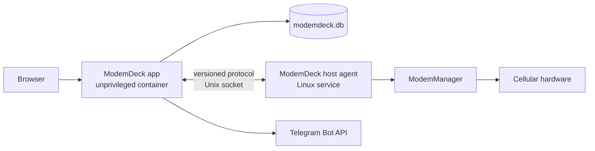

# ModemDeck

[](LICENSE)

ModemDeck is being developed as a self-hosted console for cellular contacts,
messages, calls, and attached lines. Its communication-first information
architecture is inspired by Google Voice, but ModemDeck is an independent
project and is not affiliated with Google Voice, modem vendors, or network
operators.

> **Rewrite status:** ModemDeck is a clean rewrite in progress. The current
> delivery includes authenticated contact management and read-only historical
> communication data. It is not yet a working cellular send/call product.
> Repository code, passing software tests, or a detected modem must not be
> treated as proof of hardware support.

## Delivery boundary

### Current vertical slice: authentication, contacts, and historical data

The first slice is deliberately independent of cellular hardware:

- transfer a stopped `vohive.db` SQLite file family to `modemdeck.db`;
- authenticate one configured administrator with an Argon2id password hash,
  bounded server-side sessions, HttpOnly cookies, and CSRF protection;
- create, edit, and delete contacts with canonical phone-number uniqueness and
  optimistic revision checks;
- present historical messages, calls, devices, and lines through read-only
  application APIs and screens;
- verify migration counts, relationships, and failure behavior without starting
  a modem runtime.

This slice does not send or receive live SMS, edit modem/SIM settings, place or
answer calls, request a browser microphone, or claim that a host agent works on
real hardware.

Docker Compose still binds to `127.0.0.1` by default. Built-in authentication
does not provide TLS; use an HTTPS reverse proxy and set
`MODEMDECK_SECURE_COOKIES=true` before exposing the service to a shared network.

### Future phases: hardware send and call work

The repository now contains a bounded Linux host-agent foundation and read-only
ModemManager discovery, verified only by software tests. Later phases will extend
that boundary with live line state, SMS send/receive, call control, WebRTC audio,
Telegram notifications, and server-confirmed bearer reporting. Each item
requires its own software and exact-hardware acceptance evidence before README
can describe it as current functionality.

## Target product structure

The primary navigation is ordered around communication:

1. **Contacts** - people and their phone numbers.
2. **Messages** - SMS conversations and message status.
3. **Calls** - call history first; incoming calls and the dialer arrive with the
   later hardware phase.
4. **Settings** - lines and devices, Telegram, and diagnostics.

When implemented, the dialer may select an outgoing line when more than one line
is available. It will never ask the user to select VoLTE, VoWiFi, or another
telephony bearer. An active bearer will be shown only when the server has
confirmed it; otherwise the UI will show an unknown or not-established state.

## Compatibility boundary

The only legacy compatibility is a one-time SQLite ownership transfer:

- with the old service stopped, `vohive.db` and any `-wal`, `-shm`, or
  `-journal` sidecars are renamed as one file family;
- all tables, indexes, and triggers remain in the database so unknown legacy
  data is not discarded;
- ModemDeck reads and writes its documented contact tables and reads the
  documented message, call-history, and historical line tables; retained
  operational tables are inert;
- after a successful transfer, `modemdeck.db` is the only runtime database
  path and `vohive.db` no longer exists.

There is no compatibility promise for the old API, configuration files,
environment variables, ports, container layout, device runtime, or frontend.
Secrets and operational settings must be configured again even if their old
rows remain in the database. Failure is reported explicitly; the new runtime
does not fall back to legacy code or retry forever.

See [Database migration](docs/database-migration.md) for the migration contract.

## Build and verify

Go commands run only in the pinned Docker toolchain; no host Go installation is
required. Node.js 22 is required for direct Web development.

```sh
make check
make build
```

`make check` runs both Go modules, vet, Web type checking/lint/build, and Compose
validation. `make build` writes the application and Linux host-agent artifacts
under the ignored `dist/` directory.

For a visibly marked local UI with deterministic data:

```sh
cd web
npm ci
VITE_MODEMDECK_FIXTURE=1 npm run dev -- --host 127.0.0.1 --port 4174
```

Fixture mode is development-only and is never selected by a production build.

## Linux deployment foundation

The current host agent provides read-only ModemManager discovery. Its mutation
routes deliberately return `not supported`; installing it does not enable live
SMS or calls.

1. Stop VoHive and every other process that can open `vohive.db`.
2. Back up the complete SQLite file family as described in the migration guide.
3. Choose stable numeric IDs in `.env`; keep `MODEMDECK_AGENT_GID` distinct from
   `MODEMDECK_GID`.
4. Create the password file named by `MODEMDECK_ADMIN_PASSWORD_FILE`. It must
   contain 12 to 1024 bytes and should be readable only by the operator. The
   password is mounted as a Docker secret, not placed in the container
   environment or command line.
5. Run `make install-agent` on the Linux host. This installs and starts the
   systemd unit and creates `/run/modemdeck/agent.sock`.
6. Run `make prepare-data` once, then `docker compose up --detach --build`.
7. Keep the default loopback bind, or place an HTTPS reverse proxy in front
   before changing `MODEMDECK_BIND_ADDRESS`.

The default username is `admin` and can be changed with
`MODEMDECK_ADMIN_USERNAME`. Changing the password file value on restart updates
the Argon2id hash and revokes all existing sessions atomically.

The application container remains non-root, read-only, and without host D-Bus,
`/dev`, host networking, or Linux capabilities. The socket group is its only
host-agent access path.

## Target architecture



The application container owns the web UI, authentication, business data, and
communication workflows. It runs unprivileged and does not receive `/dev`, the
host D-Bus socket, raw USB access, host networking, or broad Linux capabilities.

The Linux host agent is the sole owner of ModemManager and hardware access. The
application reaches it through a permission-restricted Unix socket. If the
agent or a modem is unavailable, hardware operations fail with a bounded,
typed error; the app does not silently switch to another control path.

See [Architecture](docs/architecture.md) for component ownership and security
boundaries.

## Hardware status

There is no accepted ModemDeck result demonstrating two-way browser-to-call
audio, and no published support matrix tying an exact modem, firmware, operator,
control path, and media path to a passing result. Legacy adapters and experiments
in this repository do not change that status. See
[Telephony validation](docs/call-webrtc-capability-and-test-plan.md).

## Scope

ModemDeck includes Telegram as its notification integration. Proxy management,
mobile proxy pools, and notification providers other than Telegram are out of
scope. Telegram voice calls and Telegram user-account automation are also not
part of the cellular call path.

## License and attribution

The repository remains under the
[PolyForm Noncommercial License 1.0.0](LICENSE). The original Required Notice is
preserved in `LICENSE`; additional attribution and the relationship to VoHive
are described in [NOTICE.md](NOTICE.md).
