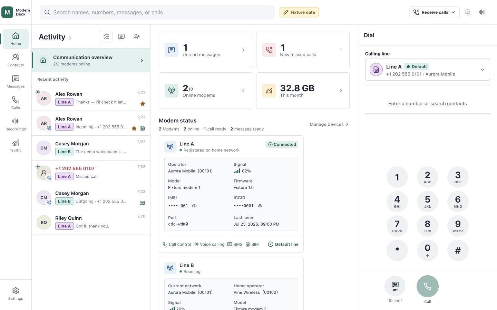
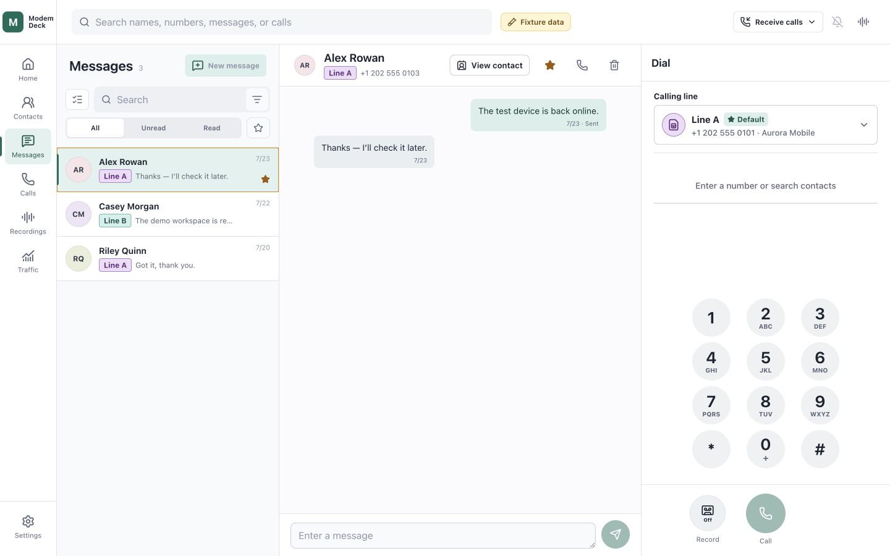
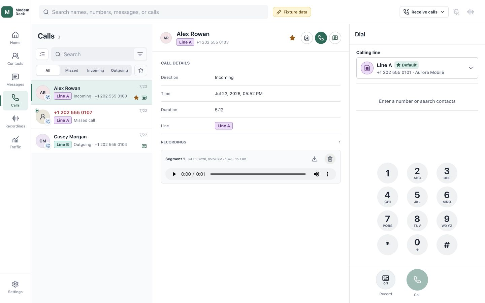
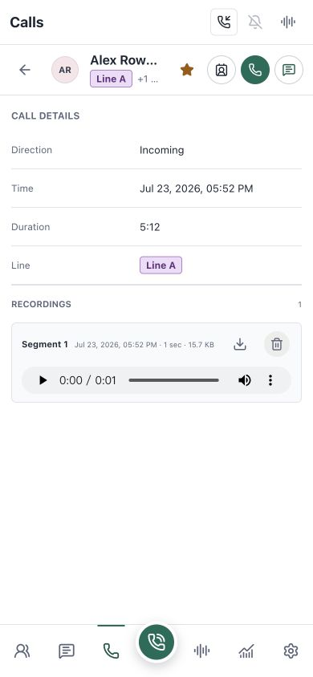

# ModemDeck（中文）

[](LICENSE)

ModemDeck 是一个管理蜂窝通话、短信、联系人、流量和多条线路的自托管控制台。
项目受到 [VoHive](https://github.com/iniwex5/vohive) 启发，但与其没有官方关系。

## 功能

- 多线路仪表盘、可自定义线路标签、默认线路和联系人首选线路。
- 联系人头像、收藏、通话与短信入口。
- 按线路收发短信、已读状态、断线重连和实时更新。
- 通话记录、拨号、DTMF、录音以及全局或单线路来电策略。
- 分线路流量统计、连接状态和 HTTP/SOCKS5 代理。
- SIM/eSIM、卡槽、归属与当前运营商及漫游状态。
- 设备、联系人和代理操作的应用内确认。
- 加密凭据、限定线路范围的 Telegram 机器人。

## 界面

| 场景 | 桌面端 | 手机端 |
| --- | --- | --- |
| 多线路仪表盘 |  |  |
| 按线路区分的消息 |  |  |
| 通话和录音 |  |  |
| 网络详情 |  |  |

## 架构

ModemDeck 由两个职责隔离的容器组成：

- `app` 是非特权容器，负责身份验证、通信流程和 SQLite 数据。它不接触
  `/dev`、D-Bus、硬件状态或主机网络，只通过只读挂载的 Unix 套接字调用
  Agent。
- `hardware` 运行私有 D-Bus、定制生产版 ModemManager 1.24.0 和 Agent，
  独占 ModemDeck 的设备控制、蜂窝数据面和网络配置。ModemManager 的生产版
  AT 接口已在构建时启用，不依赖调试模式。

默认的 **simple** 模式会停用宿主 ModemManager 和旧 `modemdeck-agent`，
阻止宿主 ModemManager 自动启动，再由容器自动发现模组。**advanced** 模式只
管理 assignment 文件中明确分配的设备；它绝不修改宿主 ModemManager、udev、
Polkit、防火墙或其他服务。宿主系统和设备分配由用户负责，发现设备缺失、歧义
或所有权冲突时 ModemDeck 会拒绝启动，而不是抢占设备。

更多边界和 assignment 格式见[部署说明](deploy/README.md)与
[硬件运行时说明](hardware/README.md)。不支持的硬件操作会明确失败，不猜测
设备路径或切换控制后端。

## 硬件兼容性

### Quectel EC2x USB

Linux 基线使用 Quectel EC2x USB、`qmi_wwan`、ModemManager 和
`usbnet=0`。命令定义见 Quectel
[EC2x/EG2x/EG9x/EM05 QCFG AT 命令手册 V1.0](https://www.quectel.com/content/uploads/2024/02/Quectel_EC2xEG2xEG9xEM05_Series_QCFG_AT_Commands_Manual_V1.0.pdf)。

已验证的 USB 身份和接口配置为：

```text
AT+QCFG="usbcfg",0x2C7C,0x0125,1,1,1,1,1,0,0
                         |      | | | | | | |
                         |      | | | | | | +-- UAC：禁用
                         |      | | | | | +---- ADB：禁用
                         |      | | | | +------ USB 网络接口：启用
                         |      | | | +-------- Modem 端口：启用
                         |      | | +---------- AT 端口：启用
                         |      | +------------ NMEA 端口：启用
                         |      +-------------- 诊断端口：启用
                         +--------------------- VID:PID 2c7c:0125
```

该配置自动保存，重启模组后生效。换到另一台主机时配置仍然保留。它只改变 USB
描述符和接口，不会安装驱动或改变硬件型号。

`usbcfg` 倒数第二位控制 ADB；网络协议由 `usbnet` 单独选择：

```text
AT+QCFG="usbnet",0   # RmNet/QMI
AT+QCFG="usbnet",1   # ECM / USB 以太网
AT+QCFG="usbnet",2   # MBIM
AT+QCFG="usbnet",3   # RNDIS
```

Linux 已验证 `usbnet=0`。macOS 没有 Quectel QMI 驱动。要使用直连 USB
以太网，先在支持 AT 命令的主机上改为 `usbnet=1`，再重启模组。第三方已验证
QDC507 的 ECM 模式可用于 macOS 和 iPadOS。这只证明网络接口可用，不代表 AT、
短信或语音功能。[Apple 文档](https://support.apple.com/zh-cn/108894)列出了
iPadOS 的 USB 转以太网支持。Windows 是否可用取决于 QMI、ECM 或 MBIM 驱动。

语音媒体还需要启用 UAC：

```text
AT+QCFG="usbcfg",0x2C7C,0x0125,1,1,1,1,1,0,1
```

枚举出 UAC 接口不代表固件已经提供通话音频路由。

### QDC507 固件与 VoLTE

系统只为 `QDC507GLEFM21` 加载 VoLTE 配置。ModemManager 通过生产级 AT
D-Bus 接口执行配置，不需要调试模式。配置成功不等于 IMS 已注册，也不能证明
实时通话的承载或音频路径。

`QDC507GLEFM21` 是定制固件，不是标准 EC25/EG25 版本。已确认刷入标准
EC25/EG25 固件会使 QDC507 变砖，严禁刷入。

实测 QDC507 将 `usbcfg` 最后一位设为 `1` 后会枚举 USB 音频接口，但媒体路由
命令 `AT+QPCMV=1,2` 返回 `ERROR`。ModemManager Voice 可以拨号、接听和挂断，
通话接通后却没有可用音频路径。因此当前 QDC507 不支持浏览器双向语音。
ModemDeck 的 WebRTC/Opus 桥接只适用于已验证主机媒体端点的硬件。

### eSIM/eUICC

Quectel
[eSIM AT 命令手册 V1.0.0](https://forums.quectel.com/uploads/short-url/A4rEKqqtf17nlInpzz8jIhF06GN.pdf)
定义了 profile 查询、启用、停用、删除、改名和下载。手册没有将 QDC507 列为
适用型号。当前硬件的只读测试结果如下：

| 指令或属性 | 结果 |
| --- | --- |
| `AT+QESIM=?` | `ERROR` |
| `AT+QESIM="eid"` | `ERROR` |
| `AT+QESIM="list"` 及卡槽参数 | `ERROR` |
| `AT+QCCID` | 可读取，未记录号码 |
| ModemManager 1.24.0 的 EID、SIM 类型和 eSIM 状态 | 未报告 |

`AT+CMEE=2` 也未返回详细 eUICC 错误。测试没有修改任何 profile。当前固件没有
可用的 `QESIM` 管理路径，QDC507 因此不支持 eSIM profile 管理。VoWiFi 尚未验证。

## 构建

```sh
make check
make build
```

工具链固定在 Docker 中，主机无需安装 Go、Node.js 或 C 工具链。`make check`
运行后端、硬件 Agent、Web、Compose 和 Dockerfile 检查；`make build` 输出到
`dist/`。

## 安装

需要 Linux（x86_64 或 arm64）、Docker Engine 和 Docker Compose 插件。
simple 模式还需要 systemd；宿主无需安装 ModemManager、Go、Node.js 或构建
工具。

默认使用 simple 模式，适合宿主不再由其他软件管理蜂窝模组的部署：

```sh
sudo ./install.sh --bind-address SERVER_IP
```

advanced 模式不改动宿主服务，只接管 assignment 中的设备。用户必须自行确保
这些设备未被宿主 ModemManager 或其他程序占用：

```sh
sudo ./install.sh \
  --mode advanced \
  --assignment-file /etc/modemdeck/device-assignments.json \
  --bind-address SERVER_IP
```

省略 `--bind-address` 时仅监听本机；可用 `--port` 修改 HTTPS 端口。重复安装
会保留 SQLite 数据、密钥、自动 TLS 状态和用户证书。自动证书可按需更新，用户
安装的证书即使过期也不会被替换。完整参数见 `./install.sh --help`。

首次打开 Web 界面时会进入“快速开始”，由首位访问者创建管理员用户名和密码。
完成后页面切换为普通登录，不再开放初始化接口。管理员可在“设置 > 系统”修改
密码；修改会撤销所有现有登录会话。

## 许可证

ModemDeck 使用 [PolyForm Noncommercial License 1.0.0](LICENSE)。
项目来源说明见 [NOTICE.md](NOTICE.md)。

---

# ModemDeck (English)

[](LICENSE)

ModemDeck is a self-hosted console for cellular calls, messages, contacts,
traffic, and multiple modem lines. It was inspired by
[VoHive](https://github.com/iniwex5/vohive) but has no official relationship
with that project.

## Features

- Multi-line dashboard, customizable line labels, a default line, and
  per-contact preferred lines.
- Contact avatars, favorites, and direct call and message actions.
- Line-aware SMS, read state, reconnect reconciliation, and real-time updates.
- Call history, dialing, DTMF, recordings, and global or per-line incoming-call
  policies.
- Per-line traffic, connection status, and HTTP/SOCKS5 proxies.
- SIM/eSIM and slot details, home and serving operators, and roaming status.
- In-app confirmation for device, contact, and proxy actions.
- Telegram bots with encrypted credentials and explicit line scopes.

## Interface

| Scene | Desktop | Mobile |
| --- | --- | --- |
| Multi-line dashboard |  |  |
| Line-aware messages |  |  |
| Calls and recordings |  |  |
| Network details |  |  |

## Architecture

ModemDeck uses two containers with separate responsibilities:

- `app` is unprivileged and owns authentication, communication workflows, and
  SQLite data. It receives no `/dev`, D-Bus, hardware state, or host networking
  and calls the Agent only through a read-only Unix socket mount.
- `hardware` runs a private D-Bus, a custom production build of ModemManager
  1.24.0, and the Agent. It exclusively owns ModemDeck device control, the
  cellular data plane, and network configuration. The production AT interface
  is enabled at build time and does not depend on debug mode.

The default **simple** mode stops host ModemManager and the legacy
`modemdeck-agent`, prevents host ModemManager from starting automatically, and
then lets the container discover modems. **Advanced** mode manages only devices
explicitly listed in its assignment file. It never changes host ModemManager,
udev, Polkit, firewall rules, or other services. The operator owns the host
configuration and device partitioning; ModemDeck fails closed if a device is
missing, ambiguous, or already owned instead of taking it over.

See the [deployment guide](deploy/README.md) and
[hardware runtime guide](hardware/README.md) for the boundaries and assignment
format. Unsupported hardware operations fail explicitly without guessing
device paths or switching control backends.

## Hardware compatibility

### Quectel EC2x USB

The Linux baseline uses Quectel EC2x USB, `qmi_wwan`, ModemManager, and
`usbnet=0`. Command definitions are in Quectel's
[EC2x/EG2x/EG9x/EM05 QCFG AT Commands Manual V1.0](https://www.quectel.com/content/uploads/2024/02/Quectel_EC2xEG2xEG9xEM05_Series_QCFG_AT_Commands_Manual_V1.0.pdf).

The validated USB identity and interface configuration is:

```text
AT+QCFG="usbcfg",0x2C7C,0x0125,1,1,1,1,1,0,0
                         |      | | | | | | |
                         |      | | | | | | +-- UAC: disabled
                         |      | | | | | +---- ADB: disabled
                         |      | | | | +------ USB network: enabled
                         |      | | | +-------- modem port: enabled
                         |      | | +---------- AT port: enabled
                         |      | +------------ NMEA port: enabled
                         |      +-------------- diagnostic port: enabled
                         +--------------------- VID:PID 2c7c:0125
```

This setting is saved automatically and takes effect after a module restart. It
stays with the module when moved to another host. It changes USB descriptors
and interfaces only; it does not install drivers or change the hardware model.

The penultimate `usbcfg` value controls ADB. `usbnet` selects the network
protocol separately:

```text
AT+QCFG="usbnet",0   # RmNet/QMI
AT+QCFG="usbnet",1   # ECM / USB Ethernet
AT+QCFG="usbnet",2   # MBIM
AT+QCFG="usbnet",3   # RNDIS
```

Linux is validated with `usbnet=0`. macOS has no Quectel QMI driver. For direct
USB Ethernet, change the module to `usbnet=1` on an AT-capable host, then
restart it. A third party has validated QDC507 ECM networking on macOS and
iPadOS. This confirms the network interface only, not AT, messaging, or voice.
[Apple documents](https://support.apple.com/en-us/108894) iPadOS USB Ethernet
support. Windows support depends on its QMI, ECM, or MBIM driver.

Voice media also requires UAC:

```text
AT+QCFG="usbcfg",0x2C7C,0x0125,1,1,1,1,1,0,1
```

An enumerated UAC interface does not prove that call audio is routed to it.

### QDC507 firmware and VoLTE

The system loads the VoLTE configuration only for `QDC507GLEFM21`.
ModemManager applies it through the production AT D-Bus interface without
debug mode. A successful configuration does not prove IMS registration, the
live-call bearer, or an audio path.

`QDC507GLEFM21` is custom firmware, not a standard EC25/EG25 release. Flashing
standard EC25/EG25 firmware has been confirmed to brick QDC507 and must never
be attempted.

On the tested QDC507, setting the final `usbcfg` value to `1` exposes a USB
audio interface, but the media-routing command `AT+QPCMV=1,2` returns `ERROR`.
ModemManager Voice can dial, answer, and hang up, yet an established call has
no usable audio path. The current QDC507 therefore does not support browser
bidirectional voice. ModemDeck's WebRTC/Opus bridge is limited to hardware with
a validated host media endpoint.

### eSIM/eUICC

Quectel's
[eSIM AT Commands Manual V1.0.0](https://forums.quectel.com/uploads/short-url/A4rEKqqtf17nlInpzz8jIhF06GN.pdf)
defines profile listing, enabling, disabling, deletion, renaming, and download.
It does not list QDC507 as an applicable model. Read-only results on the current
hardware are:

| Command or property | Result |
| --- | --- |
| `AT+QESIM=?` | `ERROR` |
| `AT+QESIM="eid"` | `ERROR` |
| `AT+QESIM="list"` and slot variants | `ERROR` |
| `AT+QCCID` | readable; identifier not recorded |
| EID, SIM type, and eSIM state from ModemManager 1.24.0 | not reported |

`AT+CMEE=2` did not return a detailed eUICC error. The test changed no profile.
The current firmware has no usable `QESIM` management path, so QDC507 eSIM
profile management is unsupported. VoWiFi is not yet validated.

## Build

```sh
make check
make build
```

Toolchains are pinned in Docker, so the host does not need Go, Node.js, or a C
toolchain. `make check` covers the backend, hardware Agent, Web app, Compose, and
Dockerfile; `make build` writes artifacts to `dist/`.

## Install

Requires Linux on x86_64 or arm64, Docker Engine, and the Docker Compose plugin.
Simple mode also requires systemd. The host does not need ModemManager, Go,
Node.js, or build toolchains.

Simple mode is the default and is intended for hosts where no other software
needs to manage the cellular modems:

```sh
sudo ./install.sh --bind-address SERVER_IP
```

Advanced mode leaves host services untouched and claims only assigned devices.
The operator must ensure that host ModemManager and other software do not own
those devices:

```sh
sudo ./install.sh \
  --mode advanced \
  --assignment-file /etc/modemdeck/device-assignments.json \
  --bind-address SERVER_IP
```

Without `--bind-address`, the service listens locally; use `--port` to change
the HTTPS port. Re-running the installer preserves SQLite data, secrets,
automatic TLS state, and user-installed certificates. Automatic certificates
may be renewed when needed; user-installed certificates are never replaced,
even after expiry. See `./install.sh --help` for all options.

The first Web visit opens Quick Start, where the first visitor creates the
administrator username and password. After setup, the page becomes the normal
login screen and the setup endpoint closes. The administrator can change the
password under Settings > System; doing so revokes every existing login
session.

## License

ModemDeck uses the [PolyForm Noncommercial License 1.0.0](LICENSE).
See [NOTICE.md](NOTICE.md) for project provenance.
