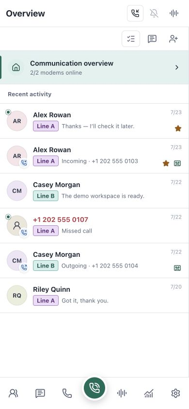
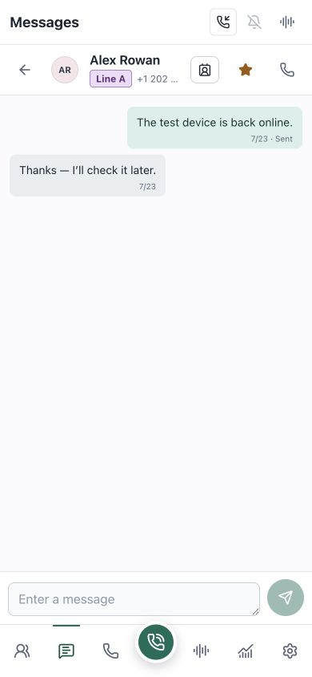
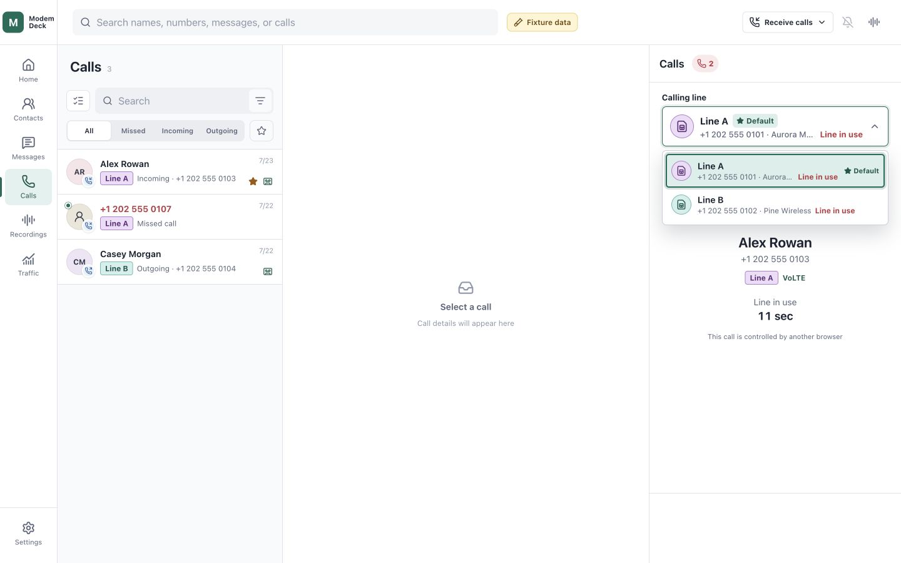

# ModemDeck（中文）

[](LICENSE)

ModemDeck 是一个管理蜂窝通话、短信、联系人、流量和多条线路的自托管控制台。
项目受到 [VoHive](https://github.com/iniwex5/vohive) 启发，但与其没有官方关系。

## 功能

- 多线路仪表盘、自定义标签、默认线路和联系人首选线路。
- 按线路管理联系人、短信、通话、录音和实时状态。
- 分线路流量、连接状态以及 HTTP/SOCKS5 代理。
- SIM/eSIM、卡槽、运营商、漫游和设备状态。
- 管理员与成员账户、线路分配、个人通讯录和 Telegram 机器人。
- Google Contacts 只读导入、vCard 导入/导出和九种界面语言。

## 快速开始

需要 Linux（x86_64 或 arm64）、Docker Engine 和 Docker Compose 插件。
默认 simple 模式还需要 systemd，并会停用宿主 ModemManager、接管蜂窝模组。

```sh
git clone https://github.com/human-agent65535/ModemDeck.git
cd ModemDeck
sudo ./install.sh
```

默认安装使用发布镜像；从当前源码构建时使用 `sudo ./install.sh --git`。
安装完成后，在宿主机打开 `https://localhost:7577` 并创建管理员。
正式部署建议使用 [Releases](https://github.com/human-agent65535/ModemDeck/releases)
中的稳定版本。advanced 模式、远程访问、Cloudflare Tunnel/TURN、证书和升级见
[部署说明](deploy/README.md)。

## 界面

| 场景 | 桌面端 | 手机端 |
| --- | --- | --- |
| 多线路总览：在线状态、默认线路与流量 |  |  |
| 按线路消息：未读、收藏与联系人动作 |  |  |
| 通话记录：详情与录音片段 |  |  |
| 模拟来电：录音开关已开启 |  |  |
| 多路通话：两条线路同时占用与切换 |  |  |

## 路线图

| 里程碑 | 状态 | 范围 |
| --- | --- | --- |
| M1 自托管多线路控制台 | ✅ 已实现 | 设备、线路、短信、联系人、流量、代理、设置和部署流程。 |
| M2 单路通话 | ✅ 已实现 | 拨号、接听、拒接、挂断、DTMF、浏览器音频和通话录音。 |
| M3 多路通话 | 🧪 已实现，未测试 | 每个 Modem 的独立通话会话、线路预占、占线显示和线路切换；待多模组实机验证。 |
| M4 多用户 | ✅ 已实现 | 初始管理员、普通成员、线路分配、用户通讯录、个人偏好和 Telegram 绑定。 |
| M5 iOS App + CallKit | 🧪 原生通话链路已实现，待实网 UAT | 已实现按用户配对、受限 Mobile Bearer API、APNs/PushKit、CallKit 接听与拨出、原生 WebRTC 音频、静音、DTMF、挂断及服务端测试来电。iOS 固定使用 Cloudflare HTTPS 并通过 TURN 中继通话媒体；Apple provider 凭据必须在服务器本地配置。 |

只有安装并连接 Cloudflare Tunnel 后才能创建 iOS 配对。二维码包含自动发现的
Cloudflare API HTTPS 地址和每用户凭据，不包含 LAN 地址，也没有过期时间；
首次通过该凭据认证的 iOS API 请求会确认配对，关闭二维码不影响等待确认。
凭据由用户或管理员撤销后才失效。iOS 通话复用现有 Call API、通话租约和 WebRTC
媒体边界，并通过 Cloudflare TURN 强制中继；来电、拨出、接听、静音、DTMF 与
挂断均由 CallKit 作为原生状态所有者。配对后的 iOS 客户端会把 APNs 与 PushKit
token 注册到 `/api/v1/mobile/push`。服务端按用户线路权限发送新短信通知，并只为
允许接听的新来电发送 VoIP push；客户端收到 VoIP payload 后交给 CallKit。
“设置 → 配对”中的测试来电通过 `/api/v1/mobile/push/test-call` 发送一个不会创建
调制解调器通话、通话记录或租约的短时合成 CallKit 来电。Apple Team ID、Key ID、
`.p8` 密钥和 Bundle ID 只保存在服务器本地，
配置方式见[部署说明](deploy/README.md#apple-push-apns-and-pushkit)。

## 架构

Web/API 业务服务与直接管理 ModemManager 和硬件的数据面相互隔离，并通过受限
Unix 套接字协作；完整部署边界见[部署说明](deploy/README.md)。

## 硬件兼容性

### Quectel QCFG USB

Linux 基线使用 Quectel USB、`qmi_wwan`、ModemManager 和 `usbnet=0`。
命令定义见 Quectel
[EC2x/EG2x/EG9x/EM05 QCFG AT 命令手册 V1.0](https://www.quectel.com/content/uploads/2024/02/Quectel_EC2xEG2xEG9xEM05_Series_QCFG_AT_Commands_Manual_V1.0.pdf)。

已验证的 USB 身份和接口配置为：

```text
AT+QCFG="usbcfg",0x2C7C,0x0125,1,1,1,1,1,0,0
                         |      | | | | | | |
                         |      | | | | | | +-- USB 语音接口：禁用
                         |      | | | | | +---- ADB：禁用
                         |      | | | | +------ USB 网络接口：启用
                         |      | | | +-------- Modem 端口：启用
                         |      | | +---------- AT 端口：启用
                         |      | +------------ NMEA 端口：启用
                         |      +-------------- 诊断端口：启用
                         +--------------------- VID:PID 2c7c:0125
```

该配置自动保存，重启模组后生效。换到另一台主机时配置仍然保留。它只改变 USB
描述符和接口，不会安装驱动或改变硬件型号。

`usbcfg` 倒数第二位控制 ADB；网络协议由 `usbnet` 单独选择：

```text
AT+QCFG="usbnet",0   # RmNet/QMI
AT+QCFG="usbnet",1   # ECM / USB 以太网
AT+QCFG="usbnet",2   # MBIM
AT+QCFG="usbnet",3   # RNDIS
```

Linux 已验证 `usbnet=0`。macOS 没有 Quectel QMI 驱动。要使用直连 USB
以太网，先在支持 AT 命令的主机上改为 `usbnet=1`，再重启模组。第三方已验证
QDC507 的 ECM 模式可用于 macOS 和 iPadOS。这只证明网络接口可用，不代表 AT、
短信或语音功能。[Apple 文档](https://support.apple.com/zh-cn/108894)列出了
iPadOS 的 USB 转以太网支持。Windows 是否可用取决于 QMI、ECM 或 MBIM 驱动。

实测固件需要将 USB 语音接口设为 `1`，ModemManager 才能可靠拨号、接听和挂断：

```text
AT+QCFG="usbcfg",0x2C7C,0x0125,1,1,1,1,1,0,1
```

这个字段只作为呼叫控制前置条件。它为 `1` 不代表固件已经提供通话音频路由，
也不代表主机已枚举出可用声卡。

### Quectel 语音与 VoLTE

可能适用的模组范围为 Quectel 官方 QCFG 手册列出的
EC20/EC21/EC25、EG21/EG25、EG91/EG95、EM05，以及实机验证过的 QDC507。
手册覆盖不代表已支持；当前实机验证仅限于下文的 EG25 和 QDC507。
QCFG IMS 的启用和关闭分别写入
`AT+QCFG="ims",1` 与 `AT+QCFG="ims",2`，重启后生效。配置成功不等于 IMS
已注册，也不能证明通话承载或音频路径。

呼叫控制和媒体能力单独探测。进入呼叫控制探测流程的设备以 AT 状态作为依据：
可读的 `usbcfg` 末位 `0` 会明确禁用，末位 `1` 会确认控制；固件返回
`ERROR` 时只标记为不可读，并由安全的 `AT+CLCC` 查询继续确认，不会把读取失败
误判成禁用。ModemManager Voice 存在时作为优先控制接口，否则由 Agent 使用
同一组 AT 呼叫命令。通话接通后，只有 `AT+QPCMV=1,2` 成功并回读为
`1,2` 才会发布 UAC PCM 路径。浏览器双向音频还需要主机声卡和已配置的媒体桥。

实测 EG25 固件 `EG25GGCR07A02M1G_A0.301.A0.301` 可读写 `usbcfg`，并能
启用及回读 `QPCMV: 1,2`。同一硬件上的 A0.302 会对 `usbcfg` 读写返回
`ERROR`；系统将其报告为固件读取失败，而不是推断 USB 配置值。

QDC507 是 EC25 系的定制变种，固件与标准 EC25/EG25 不互换。实机测试中，
刷入标准 EC25/EG25 固件后 QDC507 无法启动。

实测 QDC507 在 `usbcfg` 末位为 `1` 时可以拨号、接听和挂断。当前固件的
`AT+QPCMV=1,2` 返回 `ERROR`，所以已确认的边界是：支持呼叫控制，不支持
ModemDeck 的浏览器双向通话音频。

### eSIM/eUICC

Quectel
[eSIM AT 命令手册 V1.0.0](https://forums.quectel.com/uploads/short-url/A4rEKqqtf17nlInpzz8jIhF06GN.pdf)
定义了 profile 查询、启用、停用、删除、改名和下载。手册没有将 QDC507 列为
适用型号。当前硬件的只读测试结果如下：

| 指令或属性 | 结果 |
| --- | --- |
| `AT+QESIM=?` | `ERROR` |
| `AT+QESIM="eid"` | `ERROR` |
| `AT+QESIM="list"` 及卡槽参数 | `ERROR` |
| `AT+QCCID` | 可读取，未记录号码 |
| ModemManager 1.24.0 的 EID、SIM 类型和 eSIM 状态 | 未报告 |

`AT+CMEE=2` 也未返回详细 eUICC 错误。测试没有修改任何 profile。当前固件没有
可用的 `QESIM` 管理路径，QDC507 因此不支持 eSIM profile 管理。VoWiFi 尚未验证。

## 构建

```sh
make check
make build
```

所有工具链都固定在 Docker 中；`make check` 运行完整检查，`make build` 输出到 `dist/`。

## 许可证

ModemDeck 使用 [PolyForm Noncommercial License 1.0.0](LICENSE)。
项目来源说明见 [NOTICE.md](NOTICE.md)。

---

# ModemDeck (English)

[](LICENSE)

ModemDeck is a self-hosted console for cellular calls, messages, contacts,
traffic, and multiple modem lines. It was inspired by
[VoHive](https://github.com/iniwex5/vohive) but has no official relationship
with that project.

## Features

- Multi-line dashboard, custom labels, a default line, and per-contact preferred
  lines.
- Line-aware contacts, messages, calls, recordings, and real-time status.
- Per-line traffic, connection status, and HTTP/SOCKS5 proxies.
- SIM/eSIM, slots, operators, roaming, and device status.
- Administrator and member accounts, line assignments, personal address books,
  and Telegram bots.
- Read-only Google Contacts import, vCard import/export, and nine interface
  languages.

## Quick start

Requires Linux on x86_64 or arm64, Docker Engine, and the Docker Compose plugin.
The default simple mode also requires systemd, disables host ModemManager, and
claims the cellular modems.

```sh
git clone https://github.com/human-agent65535/ModemDeck.git
cd ModemDeck
sudo ./install.sh
```

The default install uses published images; use `sudo ./install.sh --git` to
build the current checkout.
When installation finishes, open `https://localhost:7577` on the host and
create the administrator account. For production, use a stable version from
[Releases](https://github.com/human-agent65535/ModemDeck/releases). Advanced
mode, remote access, Cloudflare Tunnel/TURN, certificates, and upgrades are
covered in the [deployment guide](deploy/README.md).

## Interface

| Scene | Desktop | Mobile |
| --- | --- | --- |
| Multi-line overview: status, default line, and traffic |  |  |
| Line-aware messages: unread state, favorites, and contact actions |  |  |
| Call history: details and recording segments |  |  |
| Simulated incoming call: recording enabled |  |  |
| Concurrent calls: two busy lines and call switching |  |  |

## Roadmap

| Milestone | Status | Scope |
| --- | --- | --- |
| M1 Self-hosted multi-line console | ✅ Implemented | Devices, lines, messages, contacts, traffic, proxies, settings, and deployment. |
| M2 Single-call flow | ✅ Implemented | Dial, answer, decline, hang up, DTMF, browser audio, and call recording. |
| M3 Concurrent calls | 🧪 Implemented, not tested | Independent sessions per modem, line reservations, busy-state display, and line switching; pending multi-modem hardware validation. |
| M4 Multi-user | ✅ Implemented | Initial administrator, members, line assignments, user address books, personal preferences, and Telegram bindings. |
| M5 iOS app + CallKit | 🧪 Native call path implemented; carrier UAT pending | Per-user pairing, a constrained Mobile Bearer API, APNs/PushKit, CallKit incoming and outgoing calls, native WebRTC audio, mute, DTMF, hang-up, and a server-originated test call are implemented. iOS always uses Cloudflare HTTPS and relays call media through TURN; Apple provider credentials must be configured locally on the server. |

An iOS pairing can be created only while the installed Cloudflare Tunnel is
connected. The QR payload contains the automatically discovered Cloudflare API
HTTPS origin and a per-device credential; it contains no LAN address and has no
expiry. Each account can retain up to three paired Apple devices and one pending
QR request. Creating a new QR replaces only that pending request, never an
already paired device. The first authenticated iOS API request confirms the
pairing; closing the QR does not cancel the pending credential. Each paired
device remains valid until the user or an administrator revokes it. iOS calls
reuse the Call API, call lease, and WebRTC media boundaries with Cloudflare TURN
relay-only configuration. CallKit
owns incoming and outgoing call state, answering, mute, DTMF, and hang-up.
After pairing, the client registers APNs and PushKit tokens through
`/api/v1/mobile/push`. The server sends new-message alerts according to each
user's line access and sends VoIP pushes only for incoming calls whose effective
policy permits receiving; the client hands those VoIP payloads to CallKit.
Each device row under Settings → Pairing has its own Test Call action, which posts to
`/api/v1/mobile/push/test-call`; it creates a short-lived synthetic CallKit call
without a modem call, call record, or lease. Apple Team ID, Key ID, `.p8`
key, and Bundle ID remain server-local. See the [deployment guide](deploy/README.md#apple-push-apns-and-pushkit).

## Architecture

The Web/API business service is isolated from the data plane that directly owns
ModemManager and hardware, and they cooperate through a restricted Unix socket.
See the [deployment guide](deploy/README.md) for the complete boundary.

## Hardware compatibility

### Quectel QCFG USB

The Linux baseline uses Quectel USB, `qmi_wwan`, ModemManager, and `usbnet=0`.
Command definitions are in Quectel's
[EC2x/EG2x/EG9x/EM05 QCFG AT Commands Manual V1.0](https://www.quectel.com/content/uploads/2024/02/Quectel_EC2xEG2xEG9xEM05_Series_QCFG_AT_Commands_Manual_V1.0.pdf).

The validated USB identity and interface configuration is:

```text
AT+QCFG="usbcfg",0x2C7C,0x0125,1,1,1,1,1,0,0
                         |      | | | | | | |
                         |      | | | | | | +-- USB voice interface: disabled
                         |      | | | | | +---- ADB: disabled
                         |      | | | | +------ USB network: enabled
                         |      | | | +-------- modem port: enabled
                         |      | | +---------- AT port: enabled
                         |      | +------------ NMEA port: enabled
                         |      +-------------- diagnostic port: enabled
                         +--------------------- VID:PID 2c7c:0125
```

This setting is saved automatically and takes effect after a module restart. It
stays with the module when moved to another host. It changes USB descriptors
and interfaces only; it does not install drivers or change the hardware model.

The penultimate `usbcfg` value controls ADB. `usbnet` selects the network
protocol separately:

```text
AT+QCFG="usbnet",0   # RmNet/QMI
AT+QCFG="usbnet",1   # ECM / USB Ethernet
AT+QCFG="usbnet",2   # MBIM
AT+QCFG="usbnet",3   # RNDIS
```

Linux is validated with `usbnet=0`. macOS has no Quectel QMI driver. For direct
USB Ethernet, change the module to `usbnet=1` on an AT-capable host, then
restart it. A third party has validated QDC507 ECM networking on macOS and
iPadOS. This confirms the network interface only, not AT, messaging, or voice.
[Apple documents](https://support.apple.com/en-us/108894) iPadOS USB Ethernet
support. Windows support depends on its QMI, ECM, or MBIM driver.

The tested firmware requires the USB voice interface to be `1` before
ModemManager can dial, answer, or hang up reliably:

```text
AT+QCFG="usbcfg",0x2C7C,0x0125,1,1,1,1,1,0,1
```

This field is only a prerequisite for call control. A value of `1` does not
prove that the firmware routes call audio or that the host has enumerated a
usable sound device.

### Quectel voice and VoLTE

The potentially applicable module range is EC20/EC21/EC25, EG21/EG25,
EG91/EG95, and EM05 from Quectel's QCFG manual, plus the field-verified QDC507
family. Manual coverage does not imply support; current hardware validation is
limited to the EG25 and QDC507 results below. QCFG IMS enable and disable write
`AT+QCFG="ims",1` and `AT+QCFG="ims",2` respectively and take effect after
restart. A successful configuration does not prove IMS registration, the
live-call bearer, or an audio path.

Call control and media are probed separately. For modules that enter the
call-control probe, AT state is authoritative for capability. A readable final
`usbcfg` value of `0` disables control and `1` confirms it. A firmware
`ERROR` is reported as unreadable and followed by the safe `AT+CLCC` query
instead of being misclassified as disabled. ModemManager Voice is the
preferred control interface when present; otherwise the Agent uses the same
AT call commands directly. After a call becomes active, its UAC PCM route is
published only when `AT+QPCMV=1,2` succeeds and reads back as `1,2`. Browser
bidirectional audio additionally requires a host sound device and a configured
media bridge.

The tested EG25 release `EG25GGCR07A02M1G_A0.301.A0.301` reads and writes
`usbcfg` and enables and reads back `QPCMV: 1,2`. A0.302 on the same hardware
returns `ERROR` for both `usbcfg` reads and writes; ModemDeck reports that as a
firmware read failure instead of inferring a USB configuration value.

QDC507 is a customized EC25-family derivative, and its firmware is not
interchangeable with standard EC25/EG25 releases. In a hardware test, the
QDC507 did not boot after a standard EC25/EG25 release was flashed.

The tested QDC507 can dial, answer, and hang up when the final `usbcfg` value
is `1`. The current firmware rejects `AT+QPCMV=1,2`; the verified boundary is
therefore call control without ModemDeck browser bidirectional call audio.

### eSIM/eUICC

Quectel's
[eSIM AT Commands Manual V1.0.0](https://forums.quectel.com/uploads/short-url/A4rEKqqtf17nlInpzz8jIhF06GN.pdf)
defines profile listing, enabling, disabling, deletion, renaming, and download.
It does not list QDC507 as an applicable model. Read-only results on the current
hardware are:

| Command or property | Result |
| --- | --- |
| `AT+QESIM=?` | `ERROR` |
| `AT+QESIM="eid"` | `ERROR` |
| `AT+QESIM="list"` and slot variants | `ERROR` |
| `AT+QCCID` | readable; identifier not recorded |
| EID, SIM type, and eSIM state from ModemManager 1.24.0 | not reported |

`AT+CMEE=2` did not return a detailed eUICC error. The test changed no profile.
The current firmware has no usable `QESIM` management path, so QDC507 eSIM
profile management is unsupported. VoWiFi is not yet validated.

## Build

```sh
make check
make build
```

All toolchains are pinned in Docker. `make check` runs the complete checks, and
`make build` writes artifacts to `dist/`.

## License

ModemDeck uses the [PolyForm Noncommercial License 1.0.0](LICENSE).
See [NOTICE.md](NOTICE.md) for project provenance.
