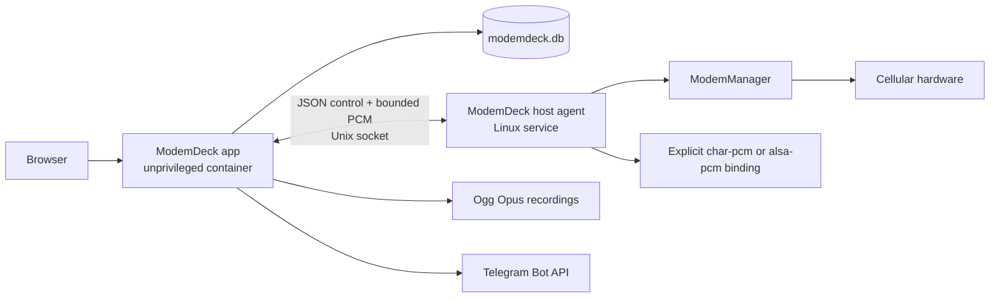

# ModemDeck

[](LICENSE)

ModemDeck is being developed as a self-hosted console for cellular contacts,
messages, calls, and attached lines. Its communication-first information
architecture is inspired by Google Voice, but ModemDeck is an independent
project and is not affiliated with Google Voice, modem vendors, or network
operators.

> **Rewrite status:** The clean rewrite now implements the current
> communication vertical in source: authentication, contacts, ModemManager
> inventory and configuration, SMS and call control, incoming-call policy,
> Telegram, call recording, database migration, and a bounded WebRTC/Opus
> media bridge. These paths are software- and fixture-tested. They are not
> proof that the exact modem, firmware, SIM, carrier, or audio endpoint on a
> deployment host has passed hardware acceptance.

## Delivery boundary

### Implemented in the current source

The application and host agent currently provide:

- one configured administrator, Argon2id password hashing, bounded server-side
  sessions, HttpOnly cookies, and CSRF protection;
- contact create, edit, delete, search, canonical phone-number ownership, and
  optimistic revision checks;
- historical and live projections for messages, calls, lines, and devices;
- SMS send through ModemManager, incoming SMS synchronization, conversation
  read state, and persisted request-id handling at the application boundary;
- outgoing dial, incoming call projection, answer, reject, hangup, DTMF, call
  history, and one active consumer call per line;
- a global receive-calls/do-not-disturb setting and per-line
  `follow_global`, `receive`, or `do_not_disturb` policy; an eligible incoming
  call receives at most one reject submission and is never automatically
  retried;
- capability-backed radio, APN/IP, data-bearer, and exact-profile VoLTE
  configuration with revision checks and authoritative read-back;
- encrypted multi-bot Telegram settings, line scopes, incoming-SMS and
  missed-call notifications, bounded polling, reply/SMS commands, and dial
  commands;
- a browser WebRTC path using Opus, with explicit conversion to 8 or 16 kHz
  mono S16_LE PCM at the host-agent boundary;
- explicit `char-pcm` and `alsa-pcm` host media bindings with no device
  guessing or automatic fallback;
- Ogg Opus call recording with a global default, one-call dial override,
  in-call control, authenticated playback, and download;
- transfer of one stopped `vohive.db` SQLite family and a standalone,
  conflict-reporting multi-source merge command.

ModemDeck does not impose a product-level modem or line count limit.
`Devices()`, `Lines()`, and Telegram line scopes do not truncate the
inventory. Generic request-body, pagination, queue, and batch limits remain
resource-protection boundaries.

Docker Compose still binds to `127.0.0.1` by default. Built-in authentication
does not provide TLS; use an HTTPS reverse proxy and set
`MODEMDECK_SECURE_COOKIES=true` before exposing the service to a shared network.
Remote browser microphone access also requires HTTPS.

### Not yet accepted on real hardware

The rewritten stack has not yet recorded an accepted `192.0.2.10` result
for:

- real SMS send/receive through each attached line;
- dial, incoming call, answer, reject, DTMF, and hangup on an exact modem and
  firmware tuple;
- an exact ModemManager `audio_port` mapped to a verified character PCM or ALSA
  endpoint;
- intelligible browser-to-phone and phone-to-browser audio;
- a real Ogg Opus recording containing the expected audio;
- one-shot DND rejection on a real incoming call;
- a server-confirmed active VoLTE, VoWiFi, or circuit-switched bearer;
- a production VoLTE vendor profile. Unknown QDC507 and EG25 identities remain
  unsupported rather than receiving a guessed command set.

VoWiFi from the lost private implementation is not part of the rewritten
runtime. The VoLTE package is an exact-match extension boundary, not a currently
exposed or hardware-validated switch.

## Product structure

The signed-in start screen is a communication dashboard. On desktop, the
Google Voice-inspired shell is a narrow navigation rail, a workspace list, a
selection-driven detail pane, and a permanent right dialer. Selecting a
message, call, or contact changes the middle detail pane instead of replacing
the whole shell. Mobile layouts collapse these regions into navigable views
and expose the dialer as a temporary panel.

Contacts, messages, and calls are the primary workspaces; lines, devices,
Telegram, recording defaults, diagnostics, and logs live under Settings rather
than competing with communication tasks in the main navigation. The header
contains the global receive-calls/do-not-disturb control and browser audio
device diagnostics. Each line keeps its own incoming-call policy and may
follow or override the global value. Reject execution capability is reported
only for the selected line; the global control does not claim that every modem
can enforce DND.

The dialer may select an outgoing line when more than one line is available. It
never asks the user to select VoLTE, VoWiFi, or another telephony bearer. An
active bearer is shown only when the server has confirmed it; otherwise the UI
shows an unknown or not-established state.

## Compatibility boundary

Legacy compatibility is limited to database data:

- normal startup can transfer one stopped `vohive.db` file family, including
  its `-wal`, `-shm`, or `-journal` sidecars, to `modemdeck.db`;
- `modemdeck-migrate` can merge contacts, SMS history, and call history from
  multiple stopped VoHive databases into one target;
- all tables, indexes, and triggers remain in the database so unknown legacy
  data is not discarded by the single-instance ownership transfer;
- multi-source merge uses stable deduplication keys, reports conflicting data
  explicitly, and commits atomically.

There is no compatibility promise for the old API, configuration files,
environment variables, ports, container layout, device runtime, or frontend.
Secrets and operational settings must be configured again even if their old
rows remain in the database. Failure is reported explicitly; the new runtime
does not fall back to legacy code or retry forever.

See [Database migration](docs/database-migration.md) for the migration contract.

## Build and verify

Release builds, checks, and Go/Web commands use pinned Docker toolchains. On
`192.0.2.10`, development, checks, and builds must run only in Docker: do
not install Go, Node.js, npm, a compiler, linker, or development headers on the
host. The root check image contains the fixed `libopus-dev` package required by
CGO; Web checks use pinned Node 22 with named dependency/cache volumes.

```sh
make check
make build
```

`make check` runs both Go modules' tests and vet, Web contract tests,
typechecking, lint and production build, Compose validation, and Dockerfile
validation. `make build` writes the application and host-agent artifacts under
`dist/`. Neither target requires host Go, Node.js, npm, or `libopus-dev`.

See [Docker-only deployment](docs/deployment.md) for the pinned host-agent
build, a containerized fixture UI, runtime dependencies, secrets, and the
`192.0.2.10` boundary. Fixture mode is development-only and is never
selected by a production image.

## Linux deployment

Build the application image and static host-agent binary in Docker. The
installation script accepts only that prebuilt binary; it does not install
packages or compile code. The only normal host runtime dependencies are
Docker/Compose, ModemManager, the systemd agent, and an HTTPS reverse proxy.
`alsa-utils` is needed only for an explicitly configured `alsa-pcm` backend.

Media is disabled by default. To enable it, an administrator must provide an
exact `/etc/modemdeck/media-bindings.json` and set
`MODEMDECK_MEDIA_BINDINGS_FILE` in `/etc/modemdeck/agent.env`. The agent does
not scan `/dev`, choose an ALSA device, or substitute one backend for another.

The application container remains non-root, read-only, and without host D-Bus,
`/dev`, host networking, or Linux capabilities. The socket group is its only
host-agent access path. See [Docker-only deployment](docs/deployment.md) for
the complete procedure.

## Architecture



The application container owns the web UI, authentication, business data, and
communication workflows. It runs unprivileged and does not receive `/dev`, the
host D-Bus socket, raw USB access, host networking, or broad Linux capabilities.

The Linux host agent is the sole owner of ModemManager and hardware access. The
application reaches it through a permission-restricted Unix socket. If the
agent or a modem is unavailable, hardware operations fail with a bounded,
typed error; the app does not silently switch to another control path.

See [Architecture](docs/architecture.md) for component ownership and security
boundaries and [Docker-only deployment](docs/deployment.md) for host setup.

## Hardware status

There is no accepted ModemDeck result demonstrating two-way browser-to-call
audio or a valid real-call recording, and no published support matrix tying an
exact modem, firmware, operator, control path, and media path to a passing
result. A server without a USB sound card is usable only if the modem exposes a
separate, explicitly supported character PCM endpoint; the source does not
promise that such an endpoint exists. Legacy adapters and experiments in this
repository do not change that status. See
[Telephony validation](docs/call-webrtc-capability-and-test-plan.md).

## Scope

ModemDeck includes Telegram as its notification integration. Proxy management,
mobile proxy pools, and notification providers other than Telegram are out of
scope. Telegram voice calls and Telegram user-account automation are also not
part of the cellular call path.

## License and attribution

The repository remains under the
[PolyForm Noncommercial License 1.0.0](LICENSE). The original Required Notice is
preserved in `LICENSE`; additional attribution and the relationship to VoHive
are described in [NOTICE.md](NOTICE.md).
